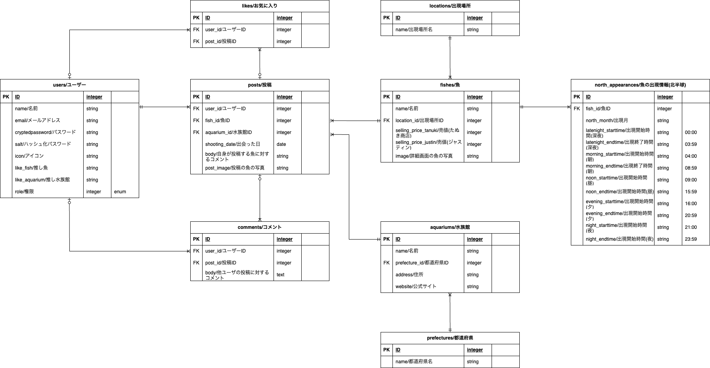

# Finding Fish Book

## サービス概要
Finding Fish Bookは、任天堂のゲームソフト『あつまれ どうぶつの森』(以降、あつ森と記載します。)
内に出現する魚の写真と現実の水族館を紐付けて投稿するサービスです。

## サービスURL
https://www.findingfishbook.com/

## 想定されるユーザー層
* あつ森ユーザー
* 魚/水族館が好き、興味があるユーザー

## サービスコンセプト
ゲーム/アニメ/漫画に影響を受けて、関連する現実の人物や出来事に興味を持つことがあり、
ユーザーにもそのような体験をしてもらいたいと思ったことが、本サービスを作成するきっかけになりました。
(フィクションで見たものをリアルで見つけた時の"これ知ってる！"となる瞬間が楽しいと感じます)

ユーザーが現実の施設に行きたいと思ってもらえるような、
フィクションとリアルの仲介役になるアプリを作りたいと考えています。
裏テーマは"皆で作る図鑑"(ユーザ皆で情報を登録していきひとつの図鑑を完成させていくイメージ)です。

あつまれどうぶつの森に出現する魚のみ対象としている点が、
他の図鑑系アプリとの差別化ポイントになると考えています。
あつ森×水族館とすることで、あつ森ユーザおよび水族館好きユーザの
両方をターゲットにすることができます。

## トップ画面

## 機能一覧
* あつ森で今釣れる魚を表示する機能
* ユーザー管理
  * ユーザー登録
  * ユーザー削除
  * ログイン/ログアウト
  * プロフィール機能
    * ユーザー名変更
    * メールアドレス変更
    * パスワードリセット
    * お気に入り魚登録
    * お気に入り水族館登録
* 投稿
  * 投稿一覧
  * 投稿詳細
  * 新規投稿
    * 魚の画像
      * CarrierWave、MiniMagickを利用し、画像のリサイズと画像データの容量制限を行っています。
      * Google Cloud Vision APIを利用し、投稿時に魚の画像か否かを診断。魚以外の画像投稿を防ぎます。
    * 魚の名前(実際に見た魚の名前を一覧から選択)
    * この魚と出会った水族館(水族館名を一覧から選択)
    * 撮影日
    * 投稿者コメント
  * 投稿編集
  * 投稿削除
  * コメント
* 魚管理
  * 魚一覧
  * 魚詳細
    以下を表示しています。
      * 魚の名前
      * ゲーム内での情報
      * その魚に出会える水族館
      * その魚に関するユーザーの投稿
* 水族館管理
  ユーザ登録可能にすると登録データにばらつきが出る可能性があるため、事前に登録済みの水族館情報を表示しています。
  * 対象水族館の参考
    * 日本動物園水族館協会
      https://www.jaza.jp/about-jaza/structure/list-aquarium
    * NAVITIME 全国の水族館
      https://www.navitime.co.jp/category/0101005/
  * 水族館MAP
    各地域ごとに水族館情報をまとめています。GoogleのMaps JavaScript API、Geocoderを使用しています。
  * 水族館一覧
    登録済みの水族館を一覧表にしています。
  * 水族館詳細
    以下を表示しています。
      * 水族館の名前
      * 住所とWebサイト
      * 出会える魚
      * その水族館のGoogleマップ
      * その水族館に関するユーザーの投稿
* 管理画面(魚や水族館のデータ追加などを行う)
  * ユーザー管理
    * ユーザー情報編集
    * ユーザー削除
  * 投稿管理
    * 投稿一覧確認
    * 投稿編集
    * 投稿削除
  * 魚管理
    * 魚一覧確認
    * 魚情報編集
  * 水族館管理
    * 水族館一覧確認
    * 水族館情報編集

## 機能イメージ図
### ログイン・ユーザー登録
| ログイン | ユーザー登録 |
----|----
|  |  |

### 投稿
| 投稿一覧 | 投稿詳細 |
----|----
|  |  |

| 新規投稿 |
|----|
|  |

### 魚
| 魚一覧 | 魚詳細 |
----|----
|  |  |

### 水族館
| 水族館MAP | 水族館MAP(各地域) |
----|----
|  |  |

| 水族館一覧 | 水族館詳細 |
----|----
|  |  |

| 水族館詳細(続き) |
|----|
|  |

### その他
| プロフィール | ゲーム内で釣れる魚表示 |
----|----
|  |  |

## 使用技術
| カテゴリ | 技術 |
----|----
| バックエンド | Ruby, Ruby on Rails |
| API | Google Cloud Vision API, Maps JavaScript API, Geocoding API |
| データベース | PostgreSQL |
| インフラ | Heroku |
| その他 | Git, GitHub |

## インフラ構成図

## ER図

## 画面遷移図
https://www.figma.com/file/kGh9r9aQPY11DUCgklfxt3/%E7%94%BB%E9%9D%A2%E9%81%B7%E7%A7%BB%E5%9B%B3?type=design&node-id=0%3A1&mode=design&t=FtXanWWSryexNmY2-1