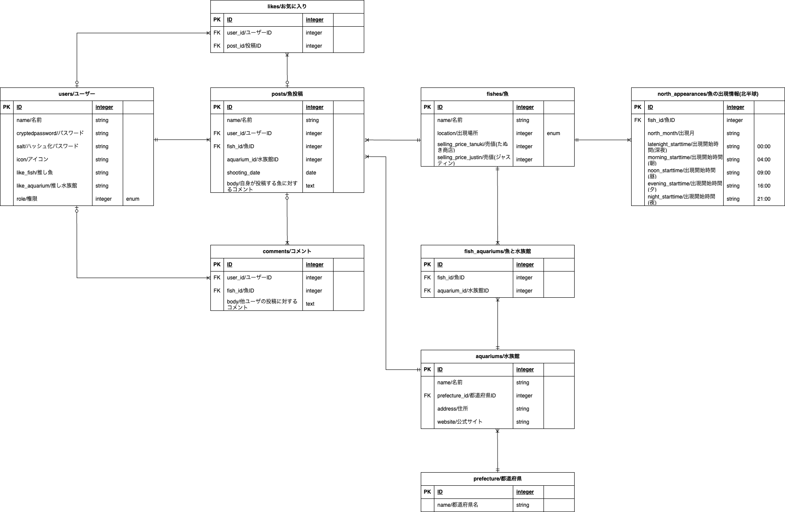

# FindingFishBook

## サービス概要
FindingFishBookは、任天堂のゲームソフト『あつまれ どうぶつの森』(以降、あつ森と記載。)
内に出現する魚を実際に見ることができる水族館を共有するサービスです。

##　想定されるユーザー層
* あつ森ユーザー
* 魚類/水族館が好き、興味がある

## サービスコンセプト
ゲーム/アニメ/漫画に影響を受けて、関連する現実の人物や出来事に興味を持つことがあり、
ユーザーにもそのような体験をしてもらいたいと思ったことが、本サービスを作成するきっかけになりました。
(フィクションで見たものをリアルで見つけた時の"これ知ってる！"となる瞬間が楽しい)

ユーザーが現実の施設に行きたいと思ってもらえるような、
フィクションとリアルの仲介役になるアプリを作りたいと考えています。
裏テーマは"皆で作る図鑑"(ユーザ皆で情報を登録していきひとつの図鑑を完成させていくイメージ)です。

あつまれどうぶつの森に出現する魚のみ対象としている点が、
他の図鑑系アプリとの差別化ポイントになると考えています。
あつ森×水族館とすることで、あつ森ユーザおよび水族館好きユーザの
両方をターゲットにすることができます。

## 実装を予定している機能
### MVP
* あつ森で今釣れる魚表示機能
	※サービストップ画面に配置。ログイン不要で利用可能な機能とする。
* ユーザ管理
  * ユーザ登録
  * ログイン
  * お気に入り魚機能
* 魚管理
  * 魚一覧
  * 魚登録(事前にゲームに出現する魚を登録しておき選択してもらう)
    * 魚の名前(必須。実際に見た魚の名前を入力。同種の他の魚も登録OKにするぐらい自由度あった方が楽しい？)
    * コメント(必須)
    * この魚と出会った水族館と日付(必須。展示期間があるかもしれないため。出会った水族館も事前にデータ登録しておき選択方式にする)
    * 魚の写真(任意)
		* CarrierWave、MiniMagickを利用予定。画像のリサイズと、画像データの容量制限を行います。
        * Google Cloud Vision APIを導入し、投稿時に魚の画像か否かを診断。魚以外の画像投稿を防ぎます。
    * 魚詳細
	    * 魚登録と同じ項目
* 水族館管理
	* 水族館一覧
  * 水族館登録
	  * 水族館名(必須)
	  * 場所(任意。入力するなら詳細な住所まで)
  * 水族館詳細
    * 水族館登録と同じ項目
### その後の機能(本リリースまでに実装予定)
* 登録済魚へのコメント投稿
* 水族館マップ(登録済水族館をマップ上に表示する)
    * ユーザ登録にすると登録データにばらつきが出る可能性があるため、事前に用意します。
    基本以下に掲載されている水族館を対象にする予定です。掲載されていない場所でも良い水族館があれば登録します。
    * 日本動物園水族館協会
        https://www.jaza.jp/about-jaza/structure/list-aquarium
    * NAVITIME 全国の水族館
        https://www.navitime.co.jp/category/0101005/
* 管理画面(魚や水族館のデータ追加などを行う)

## 機能の実装方針予定
* バックエンド
    * Ruby：最新安定バージョン(v.3.2.2でしょうか)を使用予定です。
    * Rails：こちらも最新安定バージョン(v.7.1.1でしょうか)を使用予定です。
    ただしv6とv7で変更点が多々あるようなので、v7が難しいと判断したらv6の最新バージョンにする予定です。
* その他使用予定gem
    * CarrierWave、MiniMagick：最新安定バージョンを使用予定。魚の画像投稿用です。
    * Google Maps PlatformもしくはGeocoder：最新安定バージョンを使用予定。水族館マップ用です。
    * Bootstrap：最新安定バージョンを使用予定。
* API
    * Google Cloud Vision API：魚の画像診断用です。
        https://cloud.google.com/vision?hl=ja
* フロントエンド
    * 検討中です。ただ少し調べたところVue.jsが比較的容易に導入できそうなため、候補に入れています。
* デプロイ先：Herokuを検討しています。

## 画面遷移図
https://www.figma.com/file/kGh9r9aQPY11DUCgklfxt3/%E7%94%BB%E9%9D%A2%E9%81%B7%E7%A7%BB%E5%9B%B3?type=design&node-id=0%3A1&mode=design&t=FtXanWWSryexNmY2-1

## ER図
